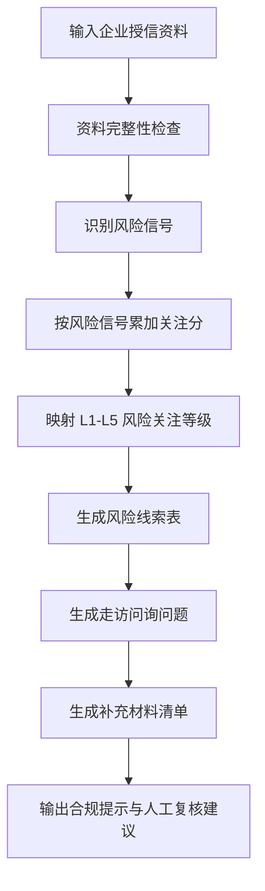

# 当前 Skill 业务逻辑说明与待校准点

## 1. 当前业务逻辑一句话

本 Skill 不是做最终授信评级，而是做“走访前风险关注等级”。它的目标是帮助客户经理判断：走访前需要重点看什么、问什么、补什么材料、是否需要风险经理参与。

## 2. 当前判断流程

## 3. 当前风险维度

| 维度 | 当前识别逻辑 |
|---|---|
| 主体资质 | 识别法定代表人或股东频繁变更 |
| 财务质量 | 识别经营性现金流为负、高应收账款、收入下滑、利润下滑、资产负债率偏高、短期债务增加 |
| 经营真实性 | 识别客户集中、交易真实性佐证不足、库存周转压力 |
| 司法舆情 | 识别被执行、负面舆情、环保合规事项 |
| 关联关系 | 识别关联交易、关联担保、实控人控制交易主体 |
| 行业与用途 | 识别行业景气度下行、授信用途合理性待核验 |

## 4. 当前等级映射

| 分数 | 等级 | 含义 |
|---:|---|---|
| 0-20 | L1 | 暂未发现明显风险 |
| 21-40 | L2 | 资料缺口或轻微信号 |
| 41-60 | L3 | 需要重点现场核验 |
| 61-80 | L4 | 多项异常或较高风险 |
| 81-100 | L5 | 重大风险，建议专项人工复核 |

## 5. 用户定标口径

本轮业务定标采用以下口径：

1. 首次授信即使资料相对完整、无明显风险，也至少归为 L2，而不是 L1。
2. 少量关联交易且金额较小，也应影响等级，但作为轻微信号处理，避免过度报高。
3. 对贸易类企业，交易真实性佐证不足应设置更高权重。
4. 不单独为跨境电商增加行业特异规则，避免因为行业标签自动抬高等级。
5. 整体演示口径应避免过度报高风险；等级是“走访前关注等级”，不是审批结论。

## 6. 当前 10 家模拟企业测试结果

| 匹配情况 | 样例 |
|---|---|
| 已匹配 | S01、S02、S03、S04、S05、S06、S07、S08、S09、S10 |
| 未匹配 | 无 |

## 7. 已完成的规则校准

### S06 郑州某农产品贸易有限公司

原始规则低估了贸易类企业的经营真实性风险。

已调整：

贸易类、供应链类企业如果出现交易真实性佐证不足，该信号权重高于普通制造业或服务业。

### S07 青岛某冷链物流有限公司

原始规则将“金额较小”的关联交易完全忽略。

已调整：

少量关联交易作为轻微信号处理，影响等级但不直接抬高到高风险。

### S08 杭州某跨境电商有限公司

原始讨论中曾考虑为跨境电商增加特殊规则。

已调整：

不因跨境电商行业标签自动抬高等级，仍按通用风险信号判断，避免过度报高。

### S09 西安某软件服务有限公司

原始规则对首次授信客户过于乐观。

已调整：

首次授信即使资料相对完整、无明显风险，也至少归为 L2，表示需要常规核验和建立银行视角的历史观察。

## 8. 后续仍可讨论的关键问题

1. L4 与 L5 的边界是否需要更严格，例如是否只有失信、大额被执行、经营真实性无法核验才进入 L5。
2. 不同行业是否需要单独规则，还是统一使用通用规则加少量行业提示。
3. 评分是否作为演示内容展示，还是只展示 L1-L5 等级和依据，避免客户误以为这是正式评级。
4. 后续接入公开数据源后，是否按“数据来源可信度”调整置信度。
